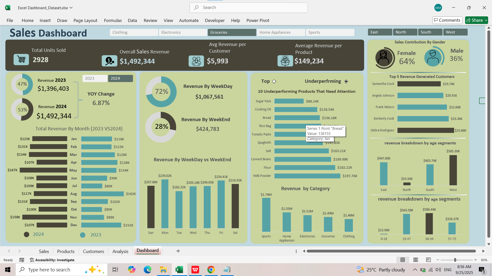

# Sales Dashboard in Excel

This project contains an interactive Sales Dashboard built in Microsoft Excel.

## Key Features
- KPIs: Total Units Sold, Sales Revenue, Avg. Revenue per Customer/Product
- YoY Revenue comparison (2023 vs 2024)
- Monthly revenue trends
- Weekday vs Weekend revenue analysis
- Category insights (top products, revenue by category)
- Customer insights (top 5 customers, gender, age segments)
- Regional performance (East, North, South, West)
- Interactive filters (Category & Region)

## Preview

## How to Use
1. Download the Excel file.
2. Enable macros/power queries if prompted.
3. Use slicers/filters for interactivity.

---